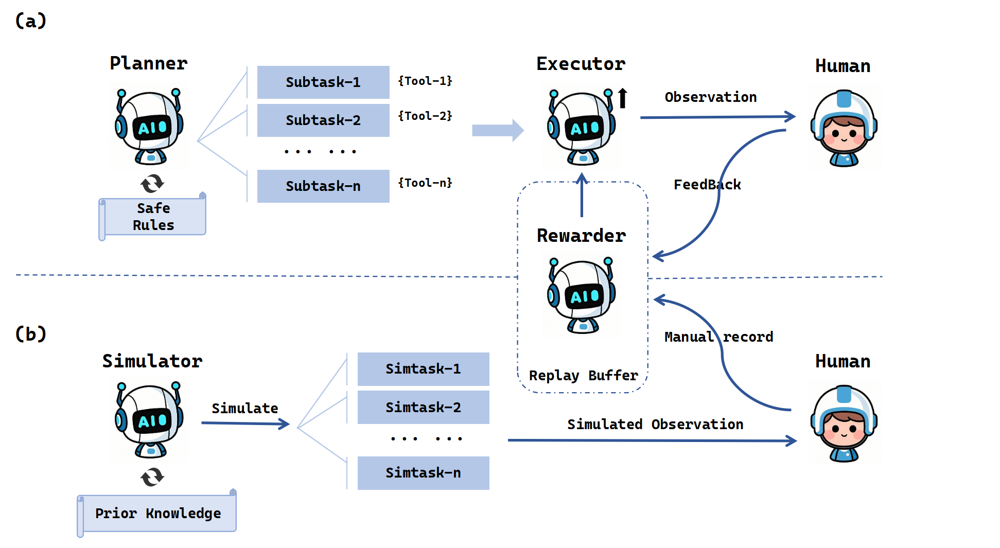

# Safety-Oriented Multi-agent System
A Trusted Human-Multi-Agent Reinforcement Learning Interaction Framework

---

## 📖 Introduction
This repository implements a **Multi-Agent System (MAS)** framework for human-machine collaborative crisis response, combining **vision-language models (VL)** and **reinforcement learning (RL)** to enhance safety and reliability. The framework features:
- **Real-Time Task Execution**: Modular task chains with built-in safety rules and human oversight.
- **Simulation Training**: Experience replay library for risk prediction and optimization.
- **Dynamic Trust Mechanism**: Balances task utility and safety constraints through RL.

**Key Contributions**:
1. Dual-mode architecture (online execution + offline simulation).
2. First fine-tuned safe LLM and training dataset for emergency scenarios.
3. 15% improvement in helpfulness and 40% reduction in risk response rate compared to baseline.

---

## 🚀 Quick Start

### Installation
```bash
git clone https://github.com/erwinmsmith/SOMAS.git
cd SOMAS
pip install -r requirements.txt
```

### Usage
1. **Real-Time Task Execution**:
```python
main.py --online
```

2. **Simulation Training**:
```python
main.py --offline
```
---
## 🧠 Framework Architecture


### Core Components
1. **Online Execution System**  
   - **Planning-Execution Pipeline**: Modular task chains drive tool operations.  
   - **Safety Guardrails**: Predefined rules and GPT-4-based risk assessment.  

2. **Offline Simulation System**  
   - **Task Generation**: Synthetic tasks from manual records and prior knowledge.  
   - **Experience Replay**: Optimizes RL policies for dynamic environments.  

---

## 📊 Experimental Results

### Key Metrics
| Domain      | Model              | Safety (↑) | Helpfulness (↑) | Risk Response Rate (↓) |
|-------------|--------------------|------------|-----------------|-------------------------|
| Safety-CV   | Qwen2-7B-VL        | **4.5**    | **4.7**         | **40%**                 |

### Highlights
- **VL models** reduced operational risks by **30%** via image semantic parsing.  
- **Dynamic safety validation** improved helpfulness by **15%** over ToolEmu.  
---
